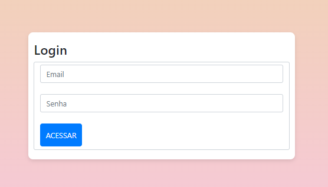
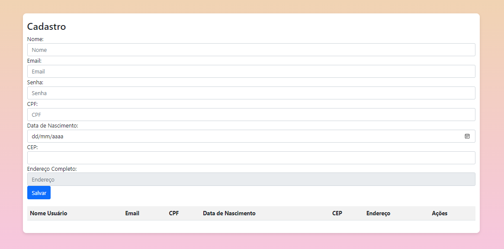

# Projeto de Login e Cadastro
## Índice
1. [Introdução](#introdução)
2. [Descrição](#descrição)
3. [Funcionalidades](#funcionalidades)
4. [Tecnologias Utilizadas](#tecnologias-utilizadas)
5. [Métodos JavaScript Utilizados](#métodos-javascript-utilizados)
6. [Interfaces](#interfaces)
  - [Interface de Login](#interface-de-login)
  - [Interface de Cadastro](#interface-de-cadastro)
7. [Adições Feitas Neste Trabalho](#adições-feitas-neste-trabalho)
8. [Referências](#referências)
## Introdução
Este projeto visa criar um sistema de login e cadastro com uma interface amigável e funcionalidades adicionais que aprimoram a experiência do usuário. Com foco na usabilidade e eficiência, o sistema permite que os usuários se cadastrem e façam login de forma simples e segura.
## Descrição
Este projeto é uma versão aprimorada de um sistema de login e cadastro, onde adicionei novas funcionalidades e melhorias na interface. O objetivo é permitir que usuários se cadastrem, façam login e visualizem informações pessoais de forma eficiente e intuitiva.
## Funcionalidades
- Validação de CPF: Implementação de regras para verificar a validade do CPF informado.
- Melhoria na Interface: O layout foi otimizado para uma melhor experiência do usuário, com uma estética que lembra um gradiente de sorvete napolitano.
- Integração com API de Endereços: Agora o sistema permite que o usuário busque seu endereço completo através de uma API.
- Exibição de dados do usuário após login: Após o login, os usuários podem visualizar suas informações pessoais de forma organizada.
## Tecnologias Utilizadas
- **HTML**: Estruturação das páginas web.
- **CSS**: Estilização da interface, incluindo o gradiente de sorvete napolitano.
- **JavaScript**: Implementação da lógica de validação e manipulação de dados.
- **API de Endereços**: Integração para busca de endereços completos.
## Métodos JavaScript Utilizados
- **`push`**:  
 Este método adiciona um ou mais elementos ao final de um array e retorna o novo comprimento desse array.  
 Utilizado para adicionar novos usuários ao array de cadastro.
- **`splice`**:  
 Este método altera o conteúdo de um array removendo ou substituindo elementos existentes e/ou adicionando novos elementos no lugar.  
 Utilizado para remover um usuário do array de cadastro.
- **`filter`**:  
 Este método cria um novo array com todos os elementos que atendem a condição implementada pela função fornecida.  
 Utilizado para filtrar usuários com base em critérios específicos, como verificar se um CPF já está cadastrado.
- **`map`**:  
 Este método cria um novo array com os resultados da chamada de uma função para cada elemento do array original.  
 Utilizado para transformar os dados dos usuários em um formato que pode ser exibido na interface.
- **`find`**:  
 Este método retorna o valor do primeiro elemento do array que atende à condição fornecida na função de teste.  
 Utilizado para encontrar um usuário específico com base em seu nome de usuário.
- **`includes`**:  
 Este método determina se um array contém um determinado elemento, retornando `true` ou `false` conforme apropriado.  
 Utilizado para verificar se o nome de usuário ou CPF já estão cadastrados.
## Interfaces
### Interface de Login

- **Descrição**: A interface de login permite que o usuário insira suas credenciais (nome de usuário e senha) para acessar sua conta.
- **Elementos**:
 - Campo para nome de usuário
 - Campo para senha
 - Botão de login
### Interface de Cadastro

- **Descrição**: A interface de cadastro permite que novos usuários se registrem no sistema, fornecendo informações pessoais e criando uma conta.
- **Elementos**:
 - Campo para nome
 - Campo para email
 - Campo para CPF
 - Campo para data de nascimento
 - Campo para endereço completo (com busca via API)
 - Botão de cadastro
## Adições Feitas Neste Trabalho
- Validação de CPF e E-mail no momento do cadastro.
- Integração com uma API para busca de endereços, permitindo ao usuário preencher o campo de endereço completo de forma mais eficiente.
- Melhoria na estética das interfaces, com a aplicação de um gradiente.
- Campos de CPF, CEP, data de nascimento e senha.
## Referências
- Documentação do JavaScript: [MDN Web Docs](https://developer.mozilla.org/pt-BR/docs/Web/JavaScript)
- API de Endereços: [ViaCEP](https://viacep.com.br/)